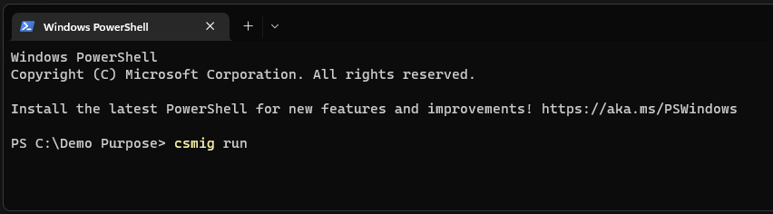
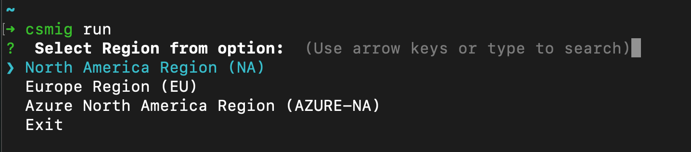
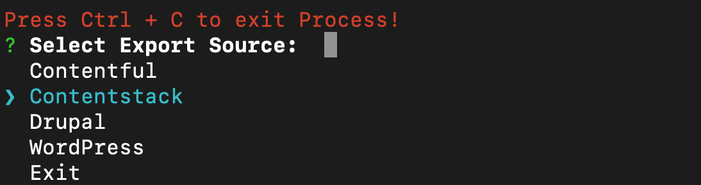
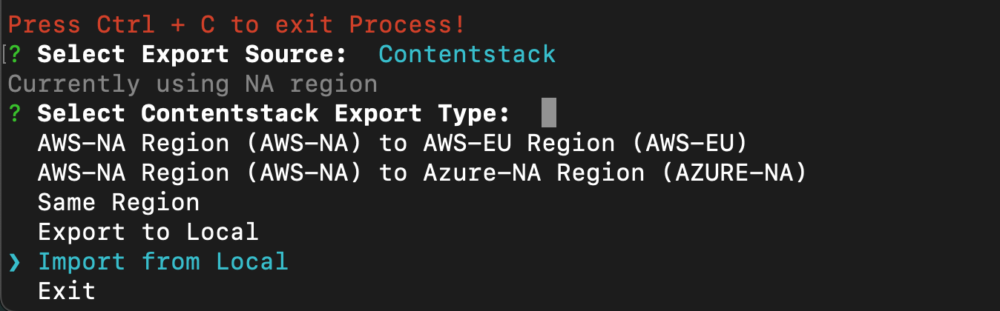
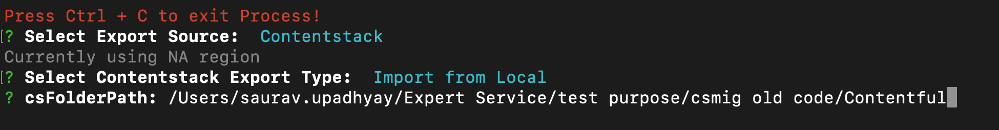
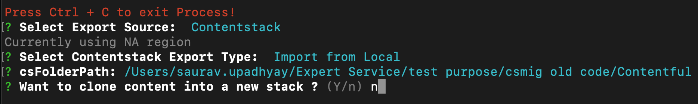
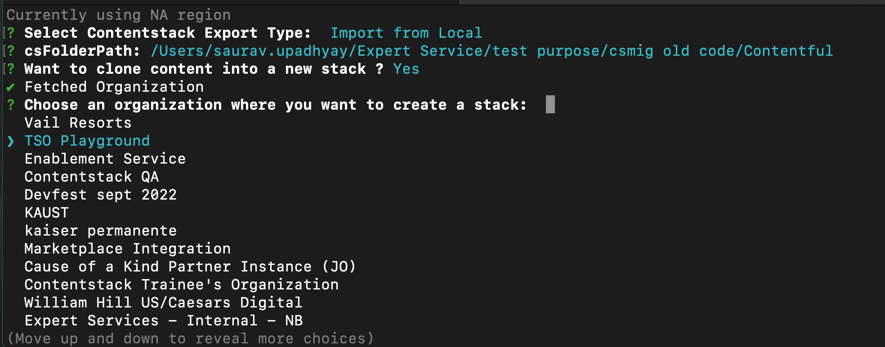
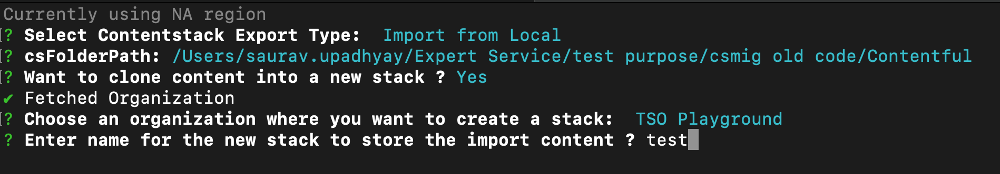
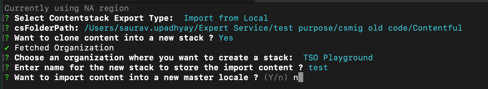
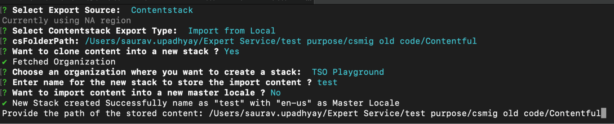

# migration-wordpress-xml

- Use git to download this repository.
- After downloading from git run this command
  `npm i`
- To start, type this command into the terminal.
  `node index.js`
- When the prompt asks you to enter information for migration, enter both the filename and the file path.
  eg:- `/users/admin/wordpress.xml`
- Each batch that is started during the migration consists of 100 posts.
- The following message will print when the last batch is migrated:- `the last batch of posts`

# Custom Changes

- You must edit the file in order to customize the post.
- You can find the **post.js** file by opening the **libs** folder.
  `libs -> post.js`
- You can find this code on line 104 of the `post.js` file.
  `let statusArray = ["publish", "inherit"];`
- Just enter your own custom status here, save the file, and run this command to put it into effect.
  `node index.js`

# CS Migration: Source

### Prerequisites

- basic understanding of CLI
- [Contentstack](https://app.contentstack.com/#!/login) account.
- Non-branch organization
- Node version 16v+

### Set Up Your App

This involves installing the csmig package. Follow the below steps for the same.

## Install the csmig package.

Configure your system with the package and proceed with the following steps. -

1. Go to the [Csmig ](https://www.npmjs.com/package/csmig)Npm package
2. Copy npm install -g csmig
3. Open a terminal and paste this line: npm install -g csmig
4. If npm install -g csmig does not work, then add sudo at the beginning and try to install this package like this:sudo npm install -g csmig
5. Once the package is installed globally, you must run this command in the terminal.

   - csmig run

     

6. You will get three region options. Select the region into which you want to import the data.

   - North America Region (NA)
   - Europe Region (EU)
   - Azure North America Region (Azure-NA)

     

7. After selecting the region you have to log in by adding your Contentstack email and password.

   

8. Once the login is successful. Select Contentstack from the options.

   

9. After selecting the Contentstack option select the Import from the local option

   

10. You have to enter the path of the folder as it verifies if the path is correct or not
    e.g.:- /user/admin/wordPressMigrationData

    

11. Select yes or no if you want to import your data into a new stack or the existing stack.

    

12. Select the Organization from the list in which you want to import data

    

13. Enter the stack name if you have selected create new stack option

    

14. Write ‘N’ while entering to new master locale and continue

    

15. Enter the path once again and your import will start.
    e.g.:- /user/admin/wordPressMigrationData

    
